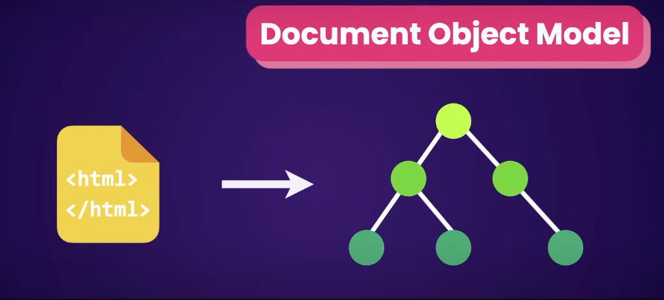
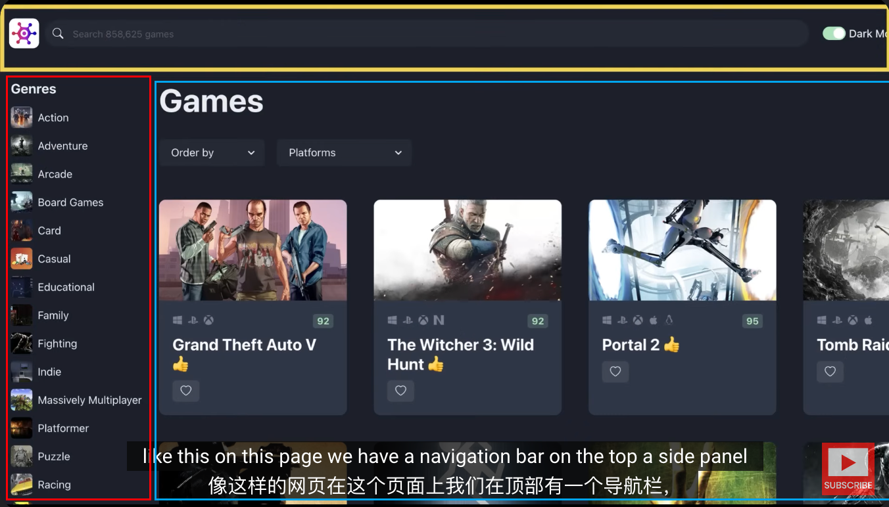
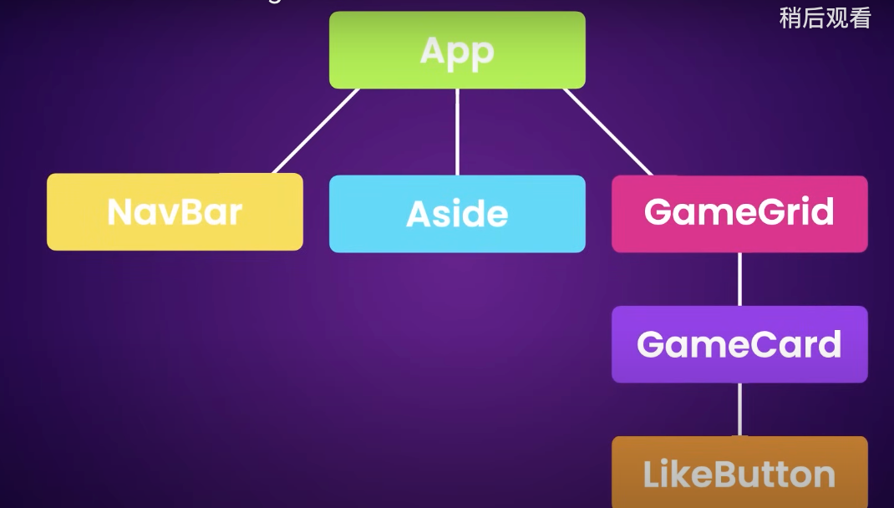
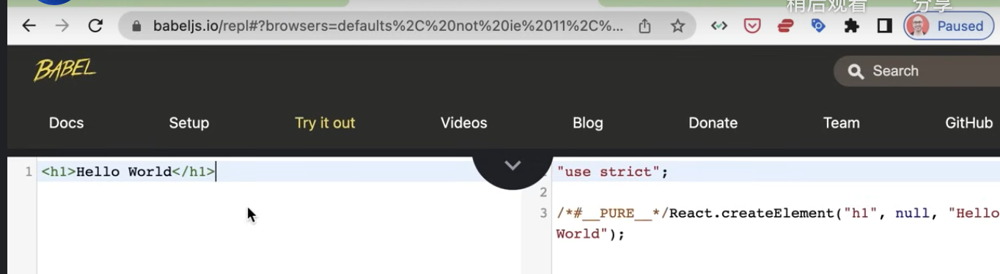

### 什么是你应该知道的
你应该对HTML, CSS和JavaScript有很好的理解，在这门课中，我们会学习TypeScript, 
TypeScript是JavaScript的超级集合，它在语言中添加了静态类型，本质上可以帮助我们
在开发的时候快速的发现错误，这可以节省我们的时间并减少我们以后得麻烦，不用担心没有学过
TypeScript，后面我会手把手的从零教学教学

```typescript
interface Props {
    age: number;
}
```

### 什么是React
React是JavaScript的库用于动态和交互式的用户界面，它是2011年Facebook创建，目前是使用最广泛的JavaScript的库。如果
你在找前端的工作，你应该很自信如何去构建一个React的应用程序

为什么React做的好

当网页加载到浏览器时，浏览器会获取HTML代码，并创建树状文档结构叫做Dom



例如我们可以用JavaScript在点击按钮时隐藏元素，
```JavaScript
const btn = document.querySelector('#btn')
btn.addEventListener('click',()=>{
    const div = document.querySelector('#div');
    div.style.display = 'none';
})
```
当我们的逻辑增加时，我们管理这样的纯粹的JavaScript代码会变得非常有挑战，这是是React发挥作用的地方。我们不需要再担心
查询和更新Dom(上面的代码例子就是查询和更新Dom), 而是用小型
可以重用组件构建代码，React会高效的创建和更新Dom, 所以
`Components` 帮助我们写`可复用`,`模块化`和`更好组织`的代码。

例如你想构建一个这样的顶部导航栏


我们可以一开始分为三个部分，最上面一行的导航栏(NavBar),
左侧的列表栏(Aside),中间部分的游戏内容(GameGrid),
中间的游戏部分还可以。我们可以将这些构建为3个组件，
当然在中间的游戏内容里面，我们还可以分为游戏卡片(GameCard)和点赞(LikeButton)组件



实际上，React是这样的组件树，应用程序是根，将这些组合在一起。

好了，让我们下一步设置环境，开发一个React的应用

### 环境设置
* node 16以上
* 使用VS Code开发
* 使用VS Code开发，强烈建议使用`Prettier`扩展来格式化代码, 然后在VS Code里面的`Perference`->`settings`->搜索`format on save`然后打上对钩，这样你每次保存都会自动格式化


## 创建React App
有两种方式创建React App 一个是Create React APP(CRA) 一个是vite
```
npm create vite@latest
```
我们使用vite构建，名称是react-app, 类型是React App 然后选择是 TypeScript

然后执行
```
npm run dev
```

补充，检查npm源
```
npm config get registry

# 如果输出不是 https://registry.npmjs.org/ 或其他你信任的源，则可能是源的问题。

# 官方源
npm config set registry https://registry.npmjs.org/

# 淘宝源
npm config set registry https://registry.npmmirror.com/
```

补充，一下命令可以打开vs code
```
code .
```

### 项目结构
node_modules 里面是我们所有的第三方库的地方，你永远不必碰他

public文件夹会有我们的图像、视频等静态文件

src文件夹里面会有我们开发的代码

package.json里面

* dependencies 是我们部署时的依赖，我们看到我们只有react和react-dom这两个依赖

* devDependencies 是我们开发时的依赖，

tsconfig.json里面说了如何将TypeScirpt编译成为JavaScript

### 创建React Component
首先在src目录下面建立Message.tsx, TypeScript的后缀是ts或tsx。我们通常用ts表示普通的TypeScript文件，用tsx表示React Component

有两种方式创建React Component ，我们可以使用JavaScript类或函数，最近函数变得很流行，所以我们使用函数创建React Component， 如果你维护老的React项目，可以翻看之前的视频看如何用JavaScript类创建React Component


```JavaScript
// 函数命名是PascalCasing 的命名方式
function Message() {
    // 这个返回是JSX，也就是JavaScript里面写XML, 它最终
    // 会编译成为HTML
    // 我们可以访问babeljs.io里面看到这段代码如何转换为JavaScript
    return <h1>Hello World</h1>
}

// 这是非常基础的组件，为了使用它，我们需要export
export default Message;
```



为了使用，我们删除App.tsx的文件
```React
// 函数命名是PascalCasing 的命名方式
function Message() {
    // 这个返回是JSX，也就是JavaScript里面写XML, 它最终
    // 会编译成为HTML
    // 我们可以访问babeljs.io里面看到这段代码如何转换为JavaScript
    
    const name = "Ning"
    if (name)
        return <h1>Hello {name}</h1>
    return <h1>Hello World</h1>
}

// 这是非常基础的组件，为了使用它，我们需要export
export default Message;
```

### React生态
* React 构建UI
* 构建路由
* 构建HTTP请求
* 管理应用状态
* 国际化
* 表单验证
* 动画
这些内容React允许你选择适合你的工具

### BootStrap
BootStrap是流行的CSS库
```
npm i bootstrap
```

我们现在有App.css文件和index.css文件，我们清空App.css和index.css文件,
然后在main.tsx里面添加
```
import 'bootstrap/dist/css/bootstrap.css'
```
这个时候我们看到页面字体在左上角，并且有漂亮的字体格式，说明我们安装成功

然后我们在src路径下面新建 components 文件夹，在这个文件夹新建ListGroup.tsx

然后我们想向BootStrap借一些代码 https://getbootstrap.com/docs/5.3/components/list-group/

在mac里面使用快捷键command + D 可以将class修改为 className

```
function ListGroup() {
    return <ul className="list-group">
    <li className="list-group-item">An item</li>
    <li className="list-group-item">A second item</li>
    <li className="list-group-item">A third item</li>
    <li className="list-group-item">A fourth item</li>
    <li className="list-group-item">And a fifth one</li>
  </ul>
}

export default ListGroup
```
