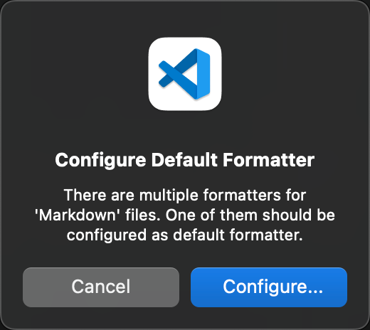
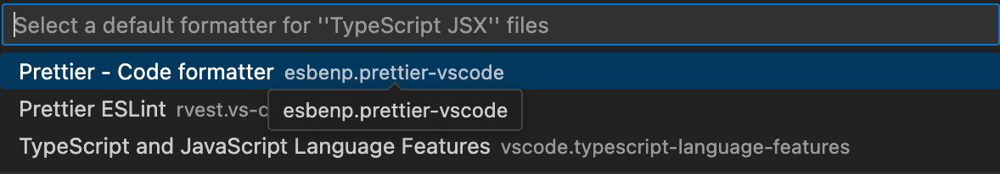

### 什么是你应该知道的

你应该对 HTML, CSS 和 JavaScript 有很好的理解，在这门课中，我们会学习 TypeScript,
TypeScript 是 JavaScript 的超级集合，它在语言中添加了静态类型，本质上可以帮助我们
在开发的时候快速的发现错误，这可以节省我们的时间并减少我们以后得麻烦，不用担心没有学过
TypeScript，后面我会手把手的从零教学教学

```typescript
interface Props {
  age: number;
}
```

### 什么是 React

React 是 JavaScript 的库用于动态和交互式的用户界面，它是 2011 年 Facebook 创建，目前是使用最广泛的 JavaScript 的库。如果
你在找前端的工作，你应该很自信如何去构建一个 React 的应用程序

为什么 React 做的好

当网页加载到浏览器时，浏览器会获取 HTML 代码，并创建树状文档结构叫做 Dom


例如我们可以用 JavaScript 在点击按钮时隐藏元素，

```JavaScript
const btn = document.querySelector('#btn')
btn.addEventListener('click',()=>{
    const div = document.querySelector('#div');
    div.style.display = 'none';
})
```

当我们的逻辑增加时，我们管理这样的纯粹的 JavaScript 代码会变得非常有挑战，这是是 React 发挥作用的地方。我们不需要再担心
查询和更新 Dom(上面的代码例子就是查询和更新 Dom), 而是用小型
可以重用组件构建代码，React 会高效的创建和更新 Dom, 所以
`Components` 帮助我们写`可复用`,`模块化`和`更好组织`的代码。

例如你想构建一个这样的顶部导航栏


我们可以一开始分为三个部分，最上面一行的导航栏(NavBar),
左侧的列表栏(Aside),中间部分的游戏内容(GameGrid),
中间的游戏部分还可以。我们可以将这些构建为 3 个组件，
当然在中间的游戏内容里面，我们还可以分为游戏卡片(GameCard)和点赞(LikeButton)组件


实际上，React 是这样的组件树，应用程序是根，将这些组合在一起。

好了，让我们下一步设置环境，开发一个 React 的应用

### 环境设置

- node 16 以上
- 使用 VS Code 开发
- 使用 VS Code 开发，强烈建议使用`Prettier`扩展来格式化代码, 然后在 VS Code 里面的`Perference`->`settings`->搜索`format on save`然后打上对钩，这样你每次保存都会自动格式化

## 创建 React App

有两种方式创建 React App 一个是 Create React APP(CRA) 一个是 vite

```
npm create vite@latest
```

我们使用 vite 构建，名称是 react-app, 类型是 React App 然后选择是 TypeScript

然后执行

```
npm run dev
```

补充，检查 npm 源

```
npm config get registry

# 如果输出不是 https://registry.npmjs.org/ 或其他你信任的源，则可能是源的问题。

# 官方源
npm config set registry https://registry.npmjs.org/

# 淘宝源
npm config set registry https://registry.npmmirror.com/
```

补充，一下命令可以打开 vs code

```
code .
```

### 项目结构

node_modules 里面是我们所有的第三方库的地方，你永远不必碰他

public 文件夹会有我们的图像、视频等静态文件

src 文件夹里面会有我们开发的代码

package.json 里面

- dependencies 是我们部署时的依赖，我们看到我们只有 react 和 react-dom 这两个依赖

- devDependencies 是我们开发时的依赖，

tsconfig.json 里面说了如何将 TypeScirpt 编译成为 JavaScript

### 创建 React Component

首先在 src 目录下面建立 Message.tsx, TypeScript 的后缀是 ts 或 tsx。我们通常用 ts 表示普通的 TypeScript 文件，用 tsx 表示 React Component

有两种方式创建 React Component ，我们可以使用 JavaScript 类或函数，最近函数变得很流行，所以我们使用函数创建 React Component， 如果你维护老的 React 项目，可以翻看之前的视频看如何用 JavaScript 类创建 React Component

```JavaScript
// 函数命名是PascalCasing 的命名方式
function Message() {
    // 这个返回是JSX，也就是JavaScript里面写XML, 它最终
    // 会编译成为HTML
    // 我们可以访问babeljs.io里面看到这段代码如何转换为JavaScript
    return <h1>Hello World</h1>
}

// 这是非常基础的组件，为了使用它，我们需要export
export default Message;
```


为了使用，我们删除 App.tsx 的文件

```React
// 函数命名是PascalCasing 的命名方式
function Message() {
    // 这个返回是JSX，也就是JavaScript里面写XML, 它最终
    // 会编译成为HTML
    // 我们可以访问babeljs.io里面看到这段代码如何转换为JavaScript

    const name = "Ning"
    if (name)
        return <h1>Hello {name}</h1>
    return <h1>Hello World</h1>
}

// 这是非常基础的组件，为了使用它，我们需要export
export default Message;
```

### React 生态

- React 构建 UI
- 构建路由
- 构建 HTTP 请求
- 管理应用状态
- 国际化
- 表单验证
- 动画
  这些内容 React 允许你选择适合你的工具

### BootStrap

BootStrap 是流行的 CSS 库

```
npm i bootstrap
```

我们现在有 App.css 文件和 index.css 文件，我们清空 App.css 和 index.css 文件,
然后在 main.tsx 里面添加

```
import 'bootstrap/dist/css/bootstrap.css'
```

这个时候我们看到页面字体在左上角，并且有漂亮的字体格式，说明我们安装成功

然后我们在 src 路径下面新建 components 文件夹，在这个文件夹新建 ListGroup.tsx

然后我们想向 BootStrap 借一些代码 https://getbootstrap.com/docs/5.3/components/list-group/

在 mac 里面使用快捷键 command + D 可以将 class 修改为 className

```
function ListGroup() {
    return <ul className="list-group">
    <li className="list-group-item">An item</li>
    <li className="list-group-item">A second item</li>
    <li className="list-group-item">A third item</li>
    <li className="list-group-item">A fourth item</li>
    <li className="list-group-item">And a fifth one</li>
  </ul>
}

export default ListGroup
```

注意到我们的代码没有格式化的漂亮，我们检查，在 mac 上是 Shift+P 或者是通过view+Command Palette搜索`>Format Document` 然后弹出来下面的这个图片, 然后我们选择``






```
function ListGroup() {
  return (
    <ul className="list-group">
      <li className="list-group-item">An item</li>
      <li className="list-group-item">A second item</li>
      <li className="list-group-item">A third item</li>
      <li className="list-group-item">A fourth item</li>
      <li className="list-group-item">And a fifth one</li>
    </ul>
  );
}

export default ListGroup;
```

注意到它这里格式化的很漂亮